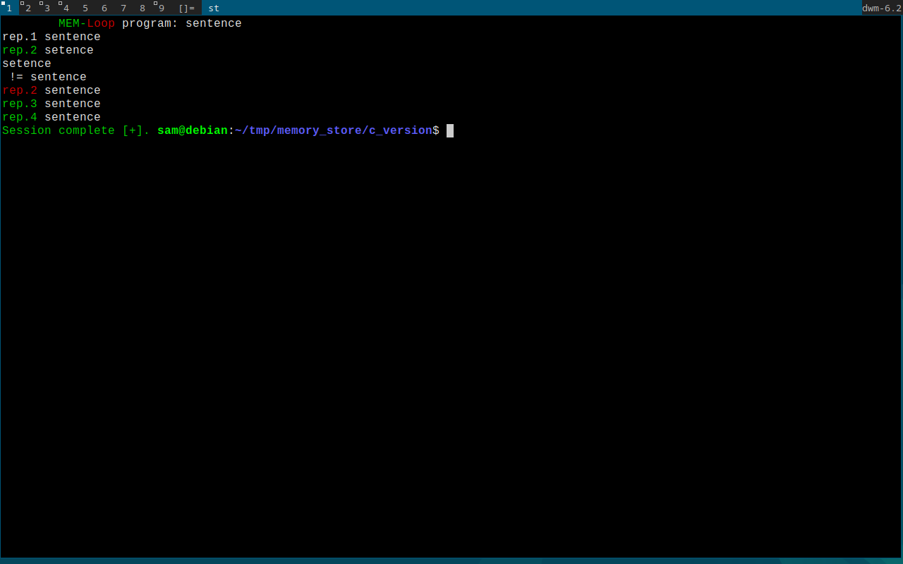

# MemRep
Rote memorisation command line program to help commit important sequences to long term memory. This is useful if you wish to memorise a sequence
Once the program is complete the sequence in memory is lost, thus being more secure than writing something over and over on analogue pen and paper.
If the user enters the sequence to memorize incorrectly, they have to repeat the repetition and the text will change red to indicate failure and green to
indicate success.

# Instructions
Run without any arguments:
  ./mr <sequence> <no_reps>

# use case
Let's say that you have a new mobile number and need to memorise it, then you can run the program with the following example:

    ./mr 435345930584305 5

I enter the sequence I wish to memorize and how many times I have to enter the sequence, being 5 times in this case.

# Example image
In this example I run:
    ./mr sentence 4

