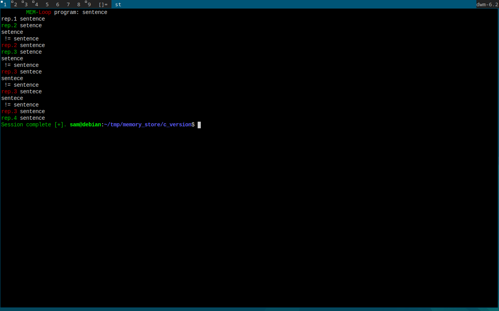

# MemRep
Rote memorisation command line program to help commit important sequences to long term memory. 

# Instructions
Run without any arguments:
  ./mr <sequence> <no_reps>

# use case
Let's say that you have a new mobile number and need to memorise it, then you can run the program with the following example:

    ./mr 435345930584305 5

I enter the sequence I wish to memorize and how many times I have to enter the sequence, being 5 times in this case.

# Example image
In this example I run:
    ./mr sentence 4

